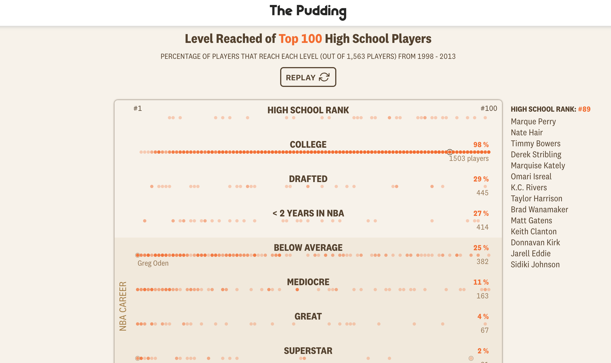
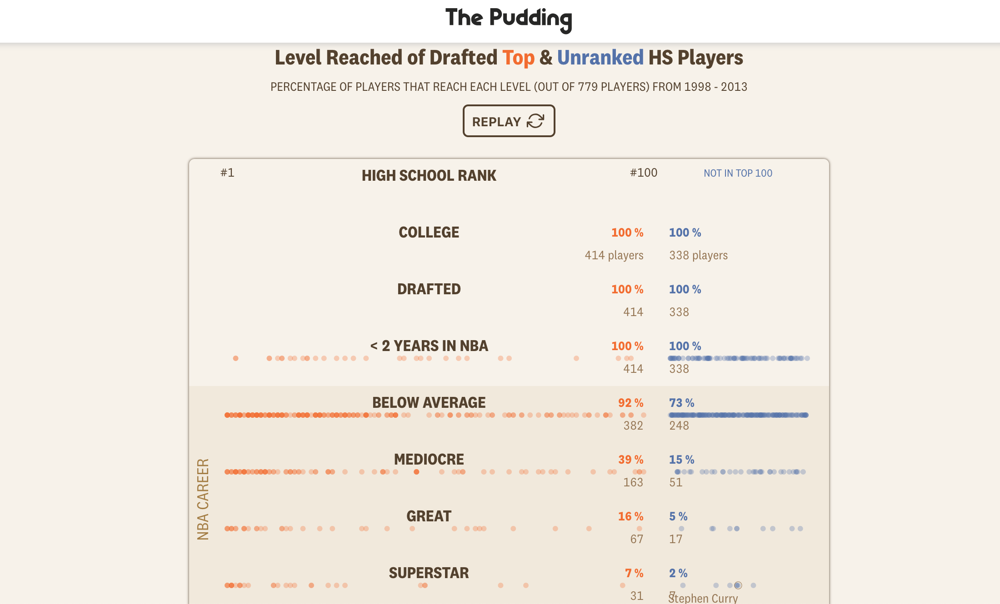

## The Premise

In the US, the 100 best high school basketball players are ranked, with the thought that those ranked higher, will have a more successful basketball career. But how often is this true? 

## My Contributions

* Data cleaning & analysis
* Some story writing
* Front-end development (HTML, CSS, and D3)

## Collaborators

This story took place when The Pudding was experimenting with pairing up someone who knows a lot about a topic ([Russell Goldenberg](https://twitter.com/codenberg)) with someone who knows nothing about that topic (me). The topic was basketball. So, Russell had an idea to track the success of those high school players that were ranked in the nation's top 100 during their senior year. He collected the data and I cleaned/analyzed it and brought the story to the internet.


## Screenshots

```{r echo = FALSE, out.width = "640", fig.align = "center"}
knitr::include_graphics("hype_video.gif")
```

```{r echo = FALSE, out.width = "100%"}


knitr::include_graphics("hype_3.png")
```
