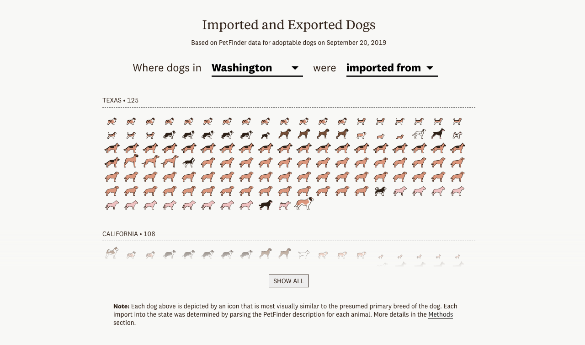
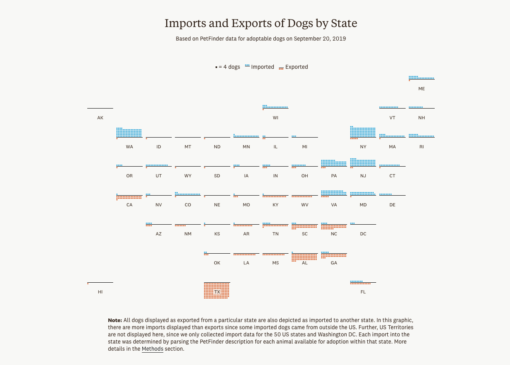
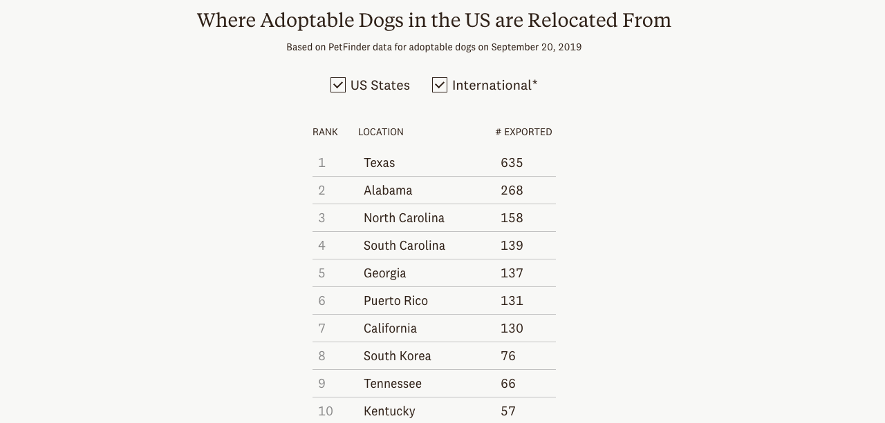

## The Premise

As a dog-lover living in Seattle, I have become familiar with how difficult it can be to adopt a dog in the city. Dogs are so popular that shelters and rescues in Seattle often import adoptable dogs from other states and sometimes other countries. After realizing that this information wasn't commonly known or understood, I decided to find a way to quantify how many dogs are moved before adoption and where they were moved to and from. 

Ultimately, I used data from PetFinder to track the 2,460 dogs that were available for adoption in a different location from where they originated. 

## My Contributions

* Story ideation
* Data cleaning & analysis
* Story writing
* Front-end development (HTML, CSS, and D3)

## Collaborators

This story was in collaboration with designer Sacha Maxim. Sacha helped me design the article and make sure that the fun quality of dog adoption was evident in throughout the piece.

## Screenshots

```{r echo = FALSE, out.width = "640", fig.align = "center"}
knitr::include_graphics("shelters_video.gif")
```

```{r echo = FALSE, out.width = "100%"}



```