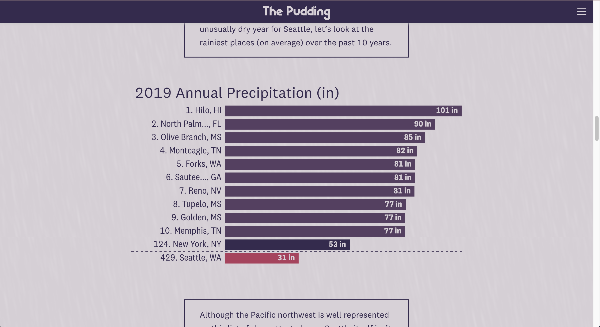

## The Premise

I moved to Seattle from Orlando, FL in 2016. Since then, the most common question I'm asked is how I deal with all the rain. This question has always perplexed me because it was much more common for me to get caught in thunderous down pours in Orlando than it ever has been in Seattle. I decided to depict this difference in precipitation levels and the ways that we talk about precipitation using data visualization and data from the Global Historical Climatology Network. 

## My Contributions

* Story ideation
* Data cleaning & analysis
* Story writing
* Front-end development (HTML, CSS, and D3)

## Collaborators

This piece was a bit of a passion project of mine and thus I completed it on my own.

## Screenshots

## Screenshots

```{r echo = FALSE, out.width = "640", fig.align = "center"}
knitr::include_graphics("rain_video.gif")
```

```{r echo = FALSE, out.width = "100%"}

knitr::include_graphics("rain_2.png")

```
