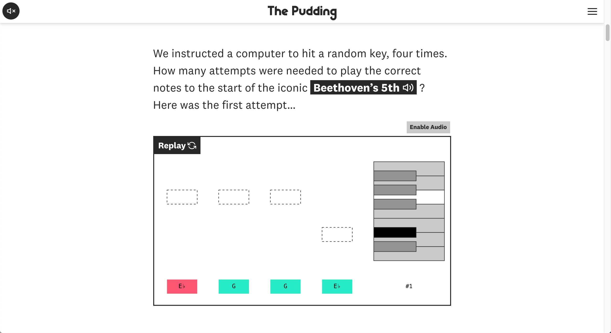
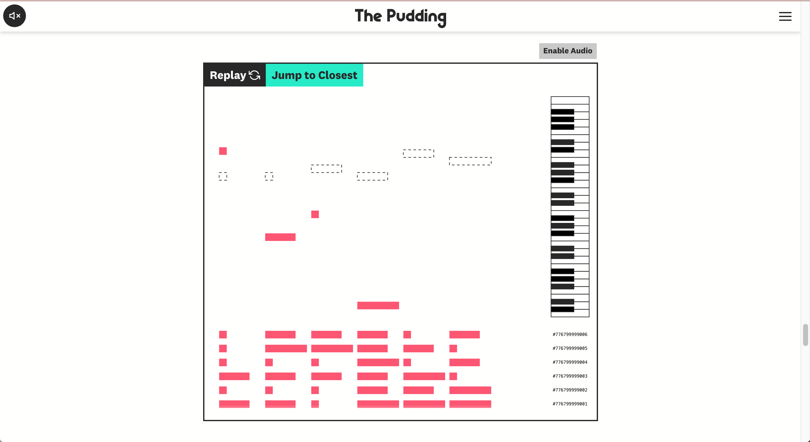

## The Premise

Probability can be a hard concept to understand, especially when discussing the probability of highly unlikely events. The original "infinite monkey theorem" posits that given an infinite amount of time, a monkey with a typewriter could eventually type out Shakespeare by randomly mashing keys. We wanted to create a visual explainer of this concept using a slightly different medium, keyboards aimed at playing well-known melodies. And using computers instead of monkeys. 

## My Contributions

* Most front-end development (HTML, CSS, and D3) including the creation of the playing keyboards

## Collaborators

This story was in collaboration with The Pudding's [Russell Goldenberg](https://twitter.com/codenberg). The idea was originally Russell's but we worked together to figure out the best way to present the information and in bringing the story to life. 

## Screenshots

```{r echo = FALSE, out.width = "640", fig.align = "center"}
knitr::include_graphics("monkey_video.gif")
```

```{r echo = FALSE, out.width = "100%"}


```

