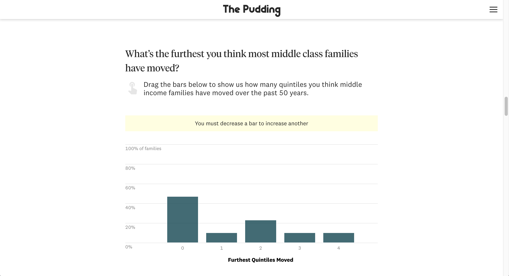
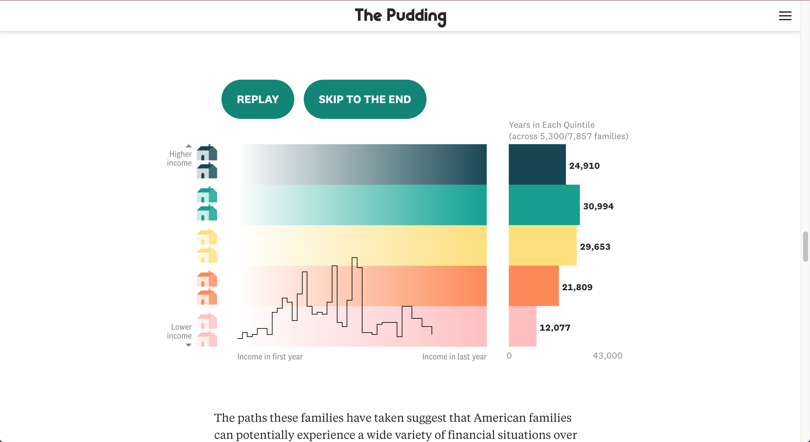
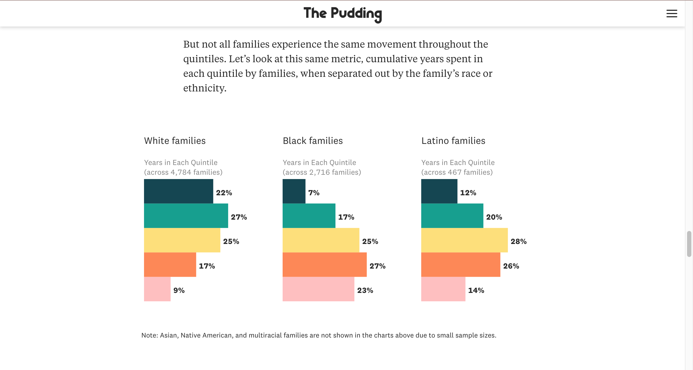

## The Premise

If you were to ask random Americans what income class they fall into, there’s a good chance they’ll say “middle class”, regardless of how much money they make. It stands to reason, then, that a change in their family’s situation, like a lost job or a new higher-paying one, is unlikely to change their perceptions on their social class. This is particularly true because, for many people, the “middle class” is just as much about your education, job, resources, and aspirations as it is about your paycheck.

In this article, we follow 11,172 families that spent at least one year in the middle class between 1968 and 2018 to see if they actually remain in the middle over that 50 year period.

## My Contributions

* Story editing
* Story writing
* Some design

## Collaborators

This story was done in collaboration with freelance collaborator [Alice Feng](https://twitter.com/fleecealeece). Alice analyzed the data and did all front-end development on this project. 

## Screenshots

```{r echo = FALSE, out.width = "640", fig.align = "center"}
knitr::include_graphics("middle_video.gif")
```

```{r echo = FALSE, out.width = "100%"}



```