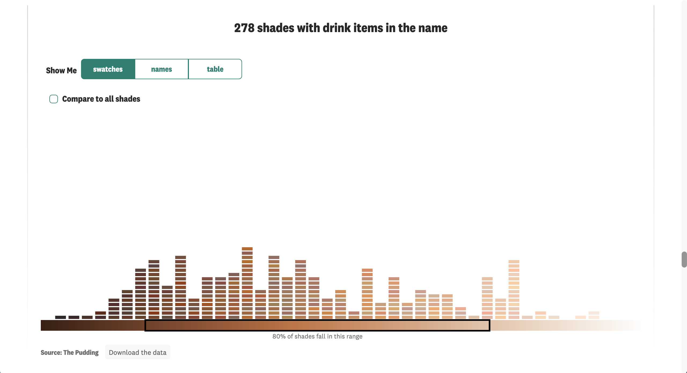

## The Premise

There are 6,816 foundation shades on Sephora & Ulta's websites. Looking at how all of those shades are named revealed something many people of color already knew: the beauty industry is full of microaggressions & anti-Black bias. This project was a deep dive into the types of names assigned to various shades of foundation in two of the biggest beauty retailers in the US. 

## My Contributions

* Story ideation
* Story direction and structure
* Data collection & analysis
* Front-end web development (HTML, CSS, D3, & Svelte) including new accessibility features

## Collaborators

This story was in collaboration with freelance contributor [Ofunne Amaka](https://twitter.com/ofunneo). As the creator of both [CocoaSwatches](https://twitter.com/CocoaSwatches) and the app [The BASEics](https://twitter.com/thebaseics), Ofunne is a subject-matter expert in this space. She helped me to structure the story and wrote the bulk of the copy. 

## Screenshots
```{r echo = FALSE, out.width = "640", fig.align = "center"}
knitr::include_graphics("foundation_video.gif")
```

```{r echo = FALSE, out.width = "100%"}
knitr::include_graphics("foundation_1.png")

knitr::include_graphics("foundation_3.png")
```